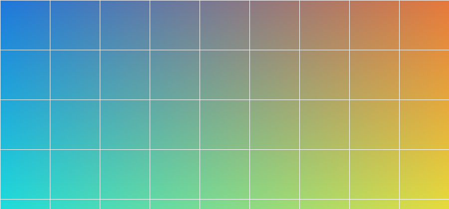

# Github Onelight 样式总览

[TOC]

# 文本

这是一段正文内容样式：**这是加粗文本样式**, <u>这是下划线样式</u>, *这是斜体字样式*, [这是超链接样式](https://github.com/zzixxxx), `This is a single line code style`, ~~这是删除线效果样式~~, ==这是文字高亮效果==，上下标: X^2^, H~2~O, $\LaTeX$, <span style='background:var(--color-2-0-c)'>这是鼠标选中效果</span>, 键盘键：<kbd>Ctrl+Shift+P</kbd> 🐳 😀

<!-- 这是注释内容 -->

# 表格

| 功能点 | 来源 | 说明 |
| ------ | ---- | ---- |
| 表格 | mdmdt + onelight | 圆角卡片、斑马纹；悬停整行浅色、当前格更深 |
| 代码块 | onelight | 白色卡片、行悬停、右下角语言标签 |
| 引用块 | onelight | 白色卡片 + 左侧色条 |
| 文本 | mdmdt | 粗体 / 高亮 / 链接图标 / kbd |

# 代码

行内代码：`npm install`、`--theme-color`。

```csharp
public async Task<int> GetStockAsync(long skuId, long depotId)
{
    // 基本单位整数库存
    var qty = await _db.Stocks
        .Where(s => s.SkuId == skuId && s.DepotId == depotId)
        .SumAsync(s => s.Quantity);
    return qty;
}
```

# 引用与警告框

> 这是普通引用块。鼠标悬停时阴影加深。
>
> > 嵌套引用会用略浅的底色区分层级。

> [!NOTE]
> 这是 **NOTE** 警告框，内含 `行内代码` 会反色显示。

> [!TIP]
> 这是 TIP。

> [!WARNING]
> 这是 WARNING。

# 数学公式

$$
u(t,x,y) = \frac{1}{2\pi c} \frac{\partial}{\partial t} \iint\limits_{r<ct} \frac{m^2(m+n)}{\sqrt{c^2t^2 - r^2}}\, dm\, dn
$$

行内公式 $E = mc^2$。

# 图片

含图段落居中、12px 圆角、悬停轻微放大。指针悬停在图片上点击可放大，点遮罩关闭。



 

# 列表

- 无序列表项
  - 二级列表
- [x] 已完成任务
- [ ] 未完成任务

1. 有序一
2. 有序二

---

打开左侧侧栏查看「大纲」与「文件」面板的树形连线样式。
