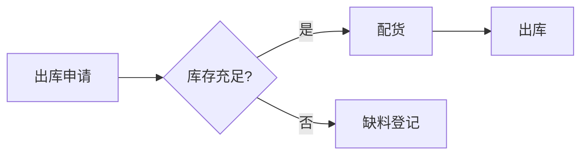

# 代码样式

> 代码块来自 onelight：白色卡片 + 阴影 + 8px 圆角、鼠标悬停的代码行高亮、右下角语言标签、绿色光标。
> 行内代码来自 mdmdt：蓝色浅底 + 深蓝文字 + 4px 圆角。

## 行内代码

安装依赖：`npm install`，查询语句：`SELECT * FROM Wms_DepotCargoLog WHERE SkuId = @skuId`，主题变量：`--theme-color`。

## 代码块

```csharp
public async Task<int> GetStockAsync(long skuId, long depotId)
{
    // 基本单位整数库存
    var qty = await _db.Stocks
        .Where(s => s.SkuId == skuId && s.DepotId == depotId)
        .SumAsync(s => s.Quantity);
    return qty;
}
```

```javascript
/**
 * 设置递增的 level 编号
 * @param tag  标签对象
 */
function setLevelNumber(tag) {
  try {
    if (typeof tag != 'object') {
      throw 'setLevelNumber() 调用时参数类型错误，必须是一个 h 标签的对象集合！';
    }
    let newValue = parseInt(tag.textContent.split('-')[1]) + 1;
    return 'level-' + newValue;
  } catch (err) {
    return err;
  }
}
```

```json
{ "theme": "github-onelight.css", "sidebar": true, "count": 42 }
```

```sql
SELECT d.DepotName, SUM(s.Quantity) AS Qty
FROM Wms_Stock s
JOIN Wms_Depot d ON d.Id = s.DepotId
GROUP BY d.DepotName
ORDER BY Qty DESC;
```

```diff
- old line
+ new line
```

没有指定语言的代码块：

```
plain text block
second line
```

## Mermaid 图表



## YAML Front Matter

在文档最顶部写入 `---` 包裹的元数据即可看到 Front Matter 块样式。
